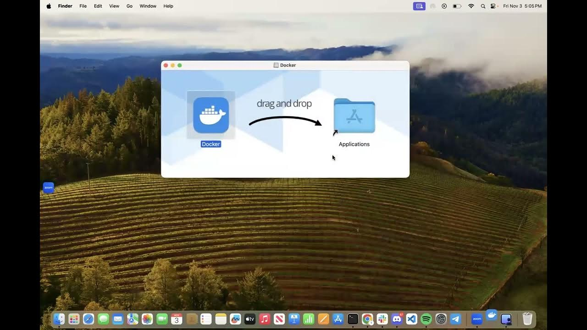
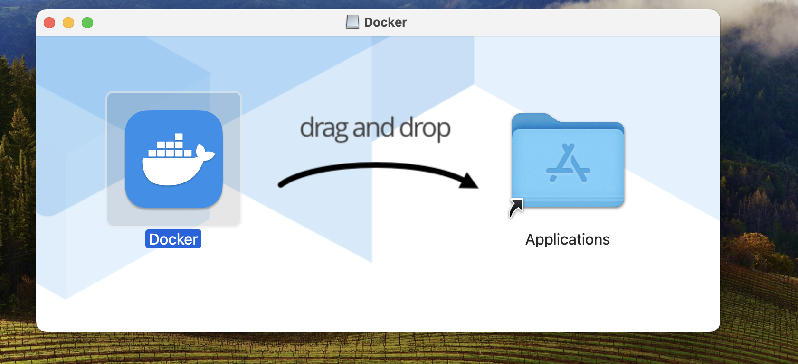
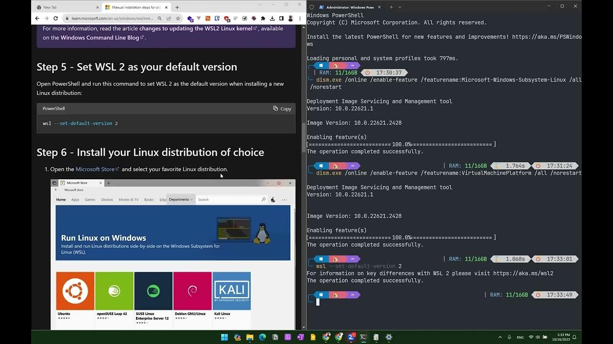
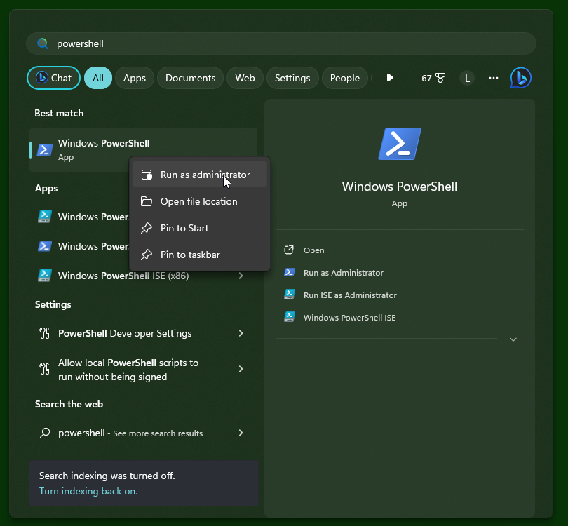
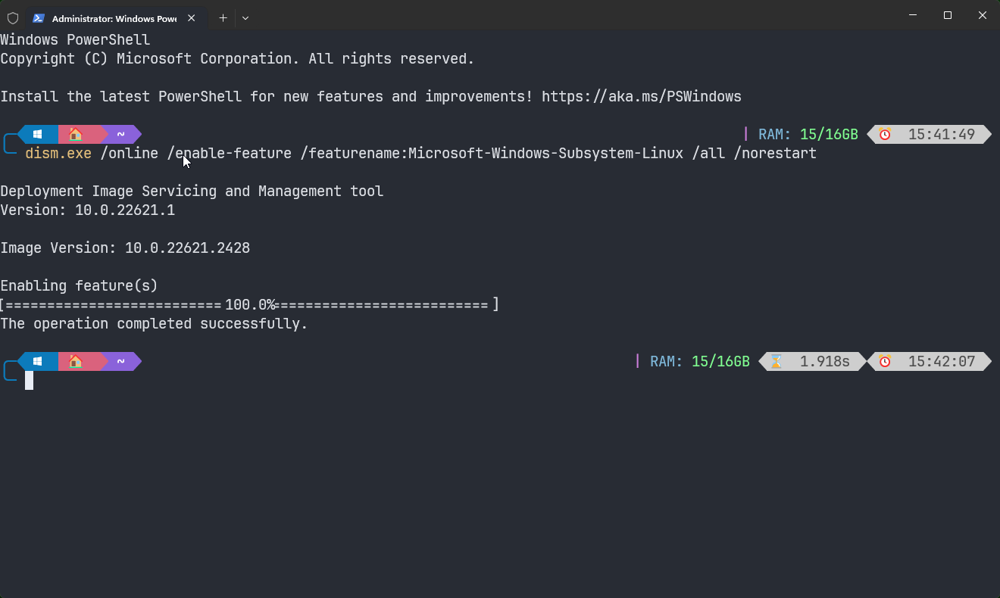
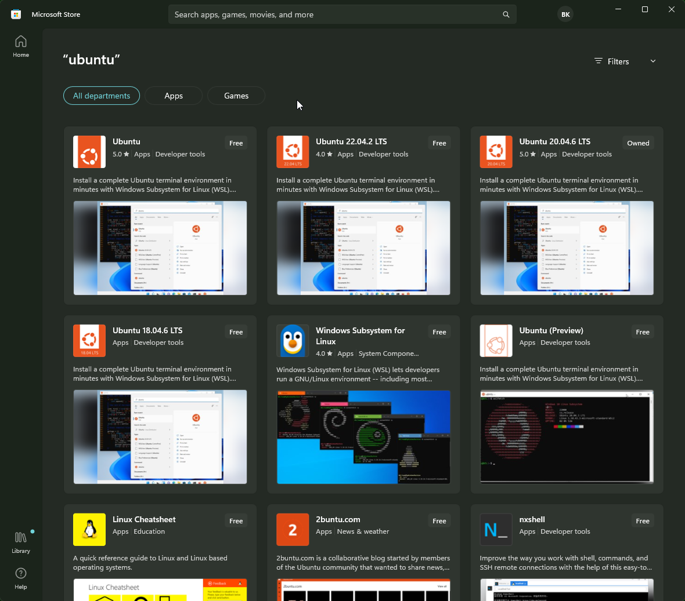
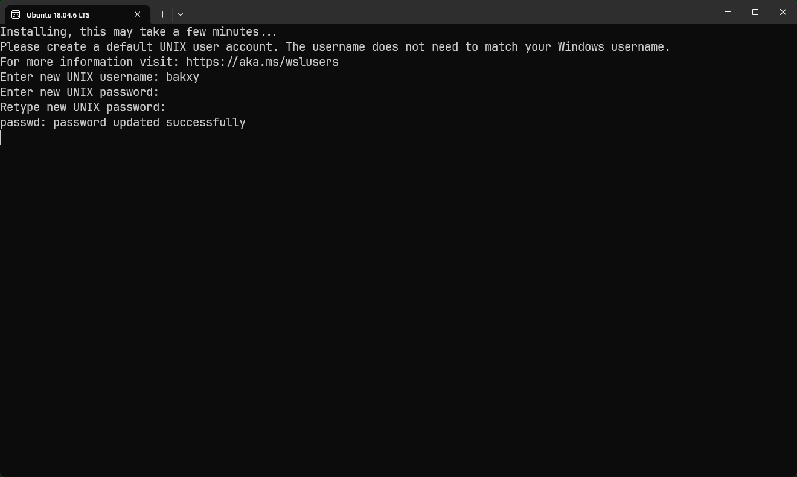
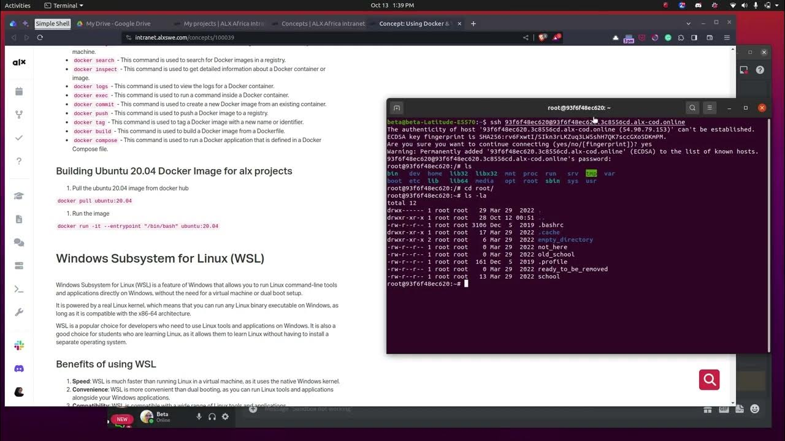

## Struggling with the sandbox? Try this: Using Docker & WSL on your local host

In this software engineering training, all projects are designed to be done in the Ubuntu 20.04 Linux environment.

There are several ways of acquiring an Ubuntu 20.04 Linux environment in case your [host operating system](https://lemp.io/what-is-a-host-operating-system-2/) is not one:

1. **Dual booting:** Install Linux alongside Windows on your computer, allowing you to choose which operating system to use at startup.
2. **Via Windows Subsystem for Linux (WSL):** provides a compatibility layer that lets you run Linux binary executables natively on Windows. `Recommended`.
3. **Via Virtual Machine (VM):** allows you to run multiple operating systems and applications on a single physical machine simultaneously.
4. **Via Linux Docker containers:** `Recommended`.

Whichever method you choose to obtain a Linux working environment for yourself is okay, We recommend using docker for its flexibility, lightweight, and ease of use. You can use docker to create a lightweight Linux environment that is isolated from the rest of your computer.

### What is Docker?

Docker is a containerization platform that allows you to package your code and dependencies into isolated containers.

#### What are containers?

Containers are lightweight, standalone, executable packages of software that include everything needed to run an application: `code`, `runtime`, `system tools`, `system libraries`, and `settings`.

#### How do Docker containers work?

When you run a Docker container, Docker creates a lightweight virtual machine that runs your application. The virtual machine is isolated from the host machine (regardless of the type of operating system you use) and from other containers, so each container has its own filesystem, network, and process space.

#### What are the benefits of using Docker?

Docker containers offer many benefits, including:

- **Portability:** Docker containers can be run on any machine with Docker installed, making them easy to deploy and share.
- **Reproducibility**: Docker containers are reproducible, meaning you can create the exact same environment on any machine. This helps debug and test your code.
- **Isolation:** Docker containers isolate your applications from each other and the host machine, helping to prevent conflicts and security vulnerabilities.
- **Efficiency:** Docker containers are lightweight and efficient, taking up less space and resources than traditional virtual machines.
- **Scalability:** Docker containers are scalable, making it easy to add or remove containers as needed.

#### What is Docker used for?

There are many ways to use Docker, but some of the most common tasks include:

- **Building Docker images:** A Docker image is a blueprint for a Docker container. You can build a Docker image from a Dockerfile, which is a text file that describes the contents of the image.
- **Running Docker containers:** Once you have built a Docker image, you can run it as a Docker container. To do this, you use the `docker run` command.
- **Managing Docker containers:** Once you have run a Docker container, you can manage it using the `docker ps`, `docker stop`, and `docker start` commands.
- **Networking Docker containers:** Docker containers can communicate with each other using Docker networks. You can create a Docker network using the `docker network create` command.
- **Storing Docker images:** Docker images can be stored in Docker registries. You can push and pull Docker images from Docker registries using the `docker push` and `docker pull` commands.

#### Setting up a development environment in Docker

Your development environment is the hardware and software you use to write code. As a developer, it is usually your responsibility to set up your environment based on the work you will be doing at your new job. As tasks change, you’ll often need to update or reconfigure your environment for new software, packages, or versions.

Please follow the appropriate guide (PC, Mac, or Linux) to set up your development environment on your operating system.

We’re always here to help, but it is your responsibility to configure your development machine.

In order to be successful in this program, your computer needs to be set up in a very specific way. If the setup is correct, you will not waste your time fighting the set up of tools and applications, so you can concentrate on the new material you are learning.

First, head to the guide for your particular operating system. This will give you an overview of anything in particular you should be aware of for your system.

##### 1\. Docker Installation on Windows

**Key steps:**

1. Download & install docker
2. Download & install WSL
3. Enable virtualization
4. Integrate WSL Ubuntu 20.04 with docker
5. Run docker  
    

##### 2\. Docker Installation on macOS

1. Go to the Docker website: https://www.docker.com/products/docker-desktop 
    
2. Click the “**Download for Mac**” button to download the latest version of Docker Desktop for Mac.
    
3. Once the download is complete, double-click the Docker.dmg file to open the installer.
    
4. Drag the Docker icon to the Applications folder to install Docker Desktop.  
    
    
5. Open Docker Desktop from the Applications folder.
    

#### Understanding important concepts about Docker

- **Docker images:** A Docker image is a lightweight, standalone, executable package of software that includes everything needed to run an application: code, runtime, system tools, system libraries, and settings.
- **Docker containers:** A Docker container is a runnable instance of a Docker image. It includes the application code and all of its dependencies, but it runs isolated from other containers on the same host.
- **Dockerfile:** A Dockerfile is a text file that contains the instructions for building a custom Docker image. It tells Docker what software to install, what configuration settings to use, and so on.
- **Docker Hub:** Docker Hub is a public registry of Docker images. It allows you to find and share images with other users.
- **Docker Compose:** Docker Compose is a tool that allows you to define and run multi-container Docker applications. It makes it easy to manage complex applications that require multiple containers.

#### Important Docker Commands

- `docker pull` - This command is used to pull a Docker ubuntu image from a registry.
- `docker run` - creates and starts a Docker container from an image
- `docker start` - is used for containers that have been previously created but are currently stopped. If you want to create and start a new container in a single step, you can use the `docker run` command.
- `docker exec` - runs a command in a running Docker container.
- `docker stop` - stops a running Docker container.
- `docker ps` -a - This command is used to list all of the Docker containers, including those that are not running.
- `docker kill` - This command is used to forcefully stop a Docker container.
- `docker rm` - This command is used to remove a Docker container.
- `docker images` - This command is used to list all of the Docker images that are stored on your machine.
- `docker search` - This command is used to search for Docker images in a registry.
- `docker inspect` - This command is used to get detailed information about a Docker container or image.
- `docker logs` - This command is used to view the logs for a Docker container.
- `docker commit` - This command is used to create a new Docker image from an existing container.
- `docker push` - This command is used to push a Docker image to a registry.
- `docker tag` - This command is used to tag a Docker image with a new name or identifier.
- `docker build` - This command is used to build a Docker image from a Dockerfile.
- `docker compose` - This command is used to run a Docker application that is defined in a Docker Compose file.

#### Building Ubuntu 20.04 Docker Image for alx projects

###### First-Time Setup

- \- `docker pull ubuntu:20.04` - Pull the ubuntu 20.04 image from docker hub
- `docker run -it --name my-ubuntu-container ubuntu:20.04` - This command is used to run a Docker ubuntu 20.04 container.

###### How to Use the Container Again

- `docker start my-ubuntu-container` - starting the container named “my-ubuntu-container” that was created from the Ubuntu 20.04 image.
- `docker exec -it my-ubuntu-container /bin/bash` - executes the /bin/bash command inside the my-ubuntu-container container in interactive mode.
- `docker stop my-ubuntu-container` - When you are done and want to stop the “my-ubuntu-container” container, use the following command.

### Windows Subsystem for Linux (WSL)

Windows Subsystem for Linux (WSL) is a feature of Windows that allows you to run Linux command-line tools and applications directly on Windows, without the need for a virtual machine or dual boot setup.

It is powered by a real Linux kernel, which means that you can run any Linux binary executable on Windows, as long as it is compatible with the x86-64 architecture.

WSL is a popular choice for developers who need to use Linux tools and applications on Windows. It is also a good choice for students who are learning Linux, as it allows them to learn Linux without having to install a separate operating system.

#### Benefits of using WSL

1. **Speed**: WSL is much faster than running Linux in a virtual machine, as it uses the native Windows kernel.
2. **Convenience**: WSL is more convenient than dual booting, as you can run Linux tools and applications alongside your Windows applications.
3. **Compatibility**: WSL is compatible with a wide range of Linux tools and applications.
4. **Flexibility**: WSL can be used for a variety of purposes, including development, education, and research.

#### Setting up WSL in Windows OS

[Microsoft installation tutorial](https://learn.microsoft.com/en-us/windows/wsl/install-manual)

1. Enable WSL. Open PowerShell as an administrator and run the following command: 
2. Enable-WindowsOptionalFeature -Online -FeatureName Microsoft-Windows-Subsystem-Linux 
3. Install a Linux distribution. Open the **Microsoft Store** and search for “**Linux**”. Select the Linux distribution that you want to install and click the “**Get**” button. Once the distribution is installed, click the “**Launch**” button to start it. 
4. Create a user account for the Linux distribution. When you start the Linux distribution for the first time, you will be prompted to create a user account. Enter a username and password for your account. 
5. Start using WSL! Once you have created a user account, you can start using WSL to run Linux commands and applications. To do this, open a PowerShell or Command Prompt window and type wsl. This will start a new Linux terminal session.

#### Tips for using WSL

- You can install multiple Linux distributions on Windows. To do this, simply repeat the installation process for each distribution.
- You can set the default Linux distribution. To do this, open the Settings app and go to “Apps” > “Features” > “Windows Subsystem for Linux”. Under “Default distribution”, select the distribution that you want to set as the default.
- You can access Windows files from WSL. To do this, use the /mnt/c directory. For example, to access the C:\\Windows directory, you would use the /mnt/c/Windows directory.
- You can run Windows applications from WSL. To do this, use the wsl –run command. For example, to run the notepad.exe application, you would use the wsl –run notepad.exe command.

### Extra Resources

[Why Do So Many Software Engineers Use Linux?](https://www.youtube.com/watch?v=otDOHt_Jges)

[Learn Docker to the next level](https://www.simplilearn.com/tutorials/docker-tutorial/getting-started-with-docker)

[Docker tutorial doc](https://docker-curriculum.com/)

