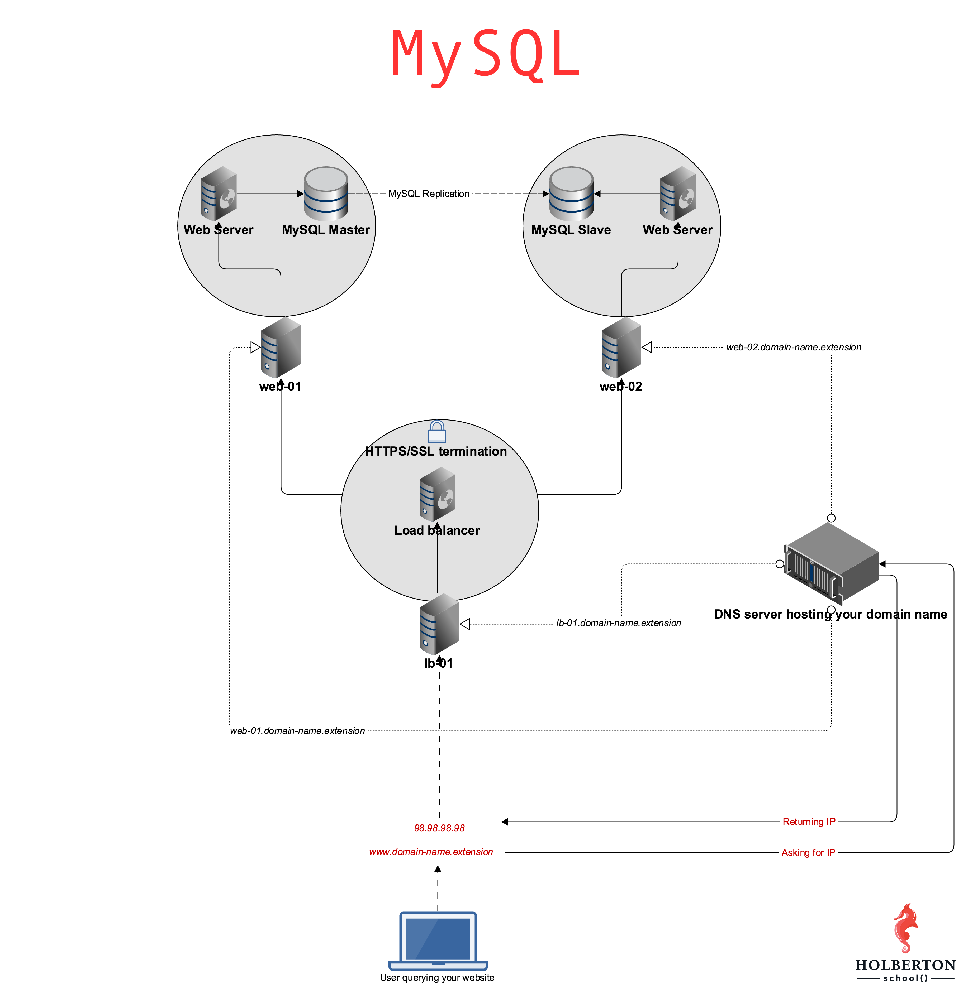

## MySQL

### Concepts

<details>
<summary>[How to] Install mysql 5.7</summary>

1. Copy the key here to your clipboard

[https://dev.mysql.com/doc/refman/5.7/en/checking-gpg-signature.html](https://dev.mysql.com/doc/refman/5.7/en/checking-gpg-signature.html)

2. Save it in a file on your machine i.e. signature.key and then

```shell
sudo apt-key add signature.key
```

3. add the apt repo

```shell
sudo sh -c 'echo "deb http://repo.mysql.com/apt/ubuntu bionic mysql-5.7" >> /etc/apt/sources.list.d/mysql.list'
```

4. update apt

```shell
sudo apt-get update
```

5. now check your available versions:

```shell
vagrant@ubuntu-focal:/vagrant$ sudo apt-cache policy mysql-server
mysql-server:
  Installed: (none)
  Candidate: 8.0.27-0ubuntu0.20.04.1
  Version table:
     8.0.27-0ubuntu0.20.04.1 500
        500 http://archive.ubuntu.com/ubuntu focal-updates/main amd64 Packages
        500 http://security.ubuntu.com/ubuntu focal-security/main amd64 Packages
     8.0.19-0ubuntu5 500
        500 http://archive.ubuntu.com/ubuntu focal/main amd64 Packages
     5.7.37-1ubuntu18.04 500
        500 http://repo.mysql.com/apt/ubuntu bionic/mysql-5.7 amd64 Packages
```

5. Now install mysql 5.7

```shell
sudo apt install -f mysql-client=5.7* mysql-community-server=5.7* mysql-server=5.7*
```
</details>



### Resources

**Read or watch**:

- [What is a primary-replica cluster](https://www.digitalocean.com/community/tutorials/how-to-choose-a-redundancy-plan-to-ensure-high-availability#sql-replication)
- [MySQL primary replica setup](https://www.digitalocean.com/community/tutorials/how-to-set-up-replication-in-mysql)
- [Build a robust database backup strategy](https://www.databasejournal.com/ms-sql/developing-a-sql-server-backup-strategy/)

**man or help**:

- `mysqldump`

### Tasks

<details>
<summary>0. Install MySQL</summary>

First, it's essential to install MySQL on **both** your web-01 and web-02 servers.

- The MySQL distribution should be version 5.7.x
- Ensure that [task #3](../0x0B-ssh/) from your [SSH project](../0x0B-ssh/) is completed for servers `web-01` and `web-02`. The checker will verify the MySQL status by connecting to your servers.
- Don’t forget to push your [README.md] to GitHub.

_Example:_

```shell
ubuntu@229-web-01:~$ mysql --version
mysql  Ver 14.14 Distrib 5.7.25, for Linux (x86_64) using  EditLine wrapper
ubuntu@229-web-01:~$
```
</details>


<details>
<summary>1. Let us in!</summary>

To ensure your servers are correctly set up, we require you to establish a user and password for **both** MySQL databases, which will grant the checker access.

- On both `web-01` and `web-02`, create a MySQL user called `holberton_user` with the host name as `localhost` and the password as `projectcorrection280hbtn`. This will enable us to check the replication status on both servers.
- Confirm that `holberton_user` has the necessary permissions to inspect the primary/replica status of your databases.
- Additionally, ensure that [task #3](../0x0B-ssh/) of your [SSH project](../0x0B-ssh/) is completed for `web-01` and `web-02`. You may need to add the public key to `web-02` as it was only added to `web-01` for this project. The checker will connect to your servers to verify the MySQL status.

_Example:_

```shell
ubuntu@229-web-01:~$ mysql -uholberton_user -p -e "SHOW GRANTS FOR 'holberton_user'@'localhost'"
Enter password:
+-----------------------------------------------------------------+
| Grants for holberton_user@localhost                             |
+-----------------------------------------------------------------+
| GRANT REPLICATION CLIENT ON *.* TO 'holberton_user'@'localhost' |
+-----------------------------------------------------------------+
ubuntu@229-web-01:~$
```
</details>


<details>
<summary>2. If only you could see what I've seen with your eyes</summary>

To establish replication, it's necessary to have a database with a minimum of one table and one row in your primary MySQL server (web-01) to replicate.

- Construct a database called `tyrell_corp`.
- Inside the `tyrell_corp` database, generate a table named `nexus6` and insert at least one record into it.
- Ensure that `holberton_user` has `SELECT` permissions on your table, enabling us to verify the existence of the table and that it's not empty.

_Example:_

```shell
ubuntu@229-web-01:~$ mysql -uholberton_user -p -e "use tyrell_corp; select * from nexus6"
Enter password:
+----+-------+
| id | name  |
+----+-------+
|  1 | Leon  |
+----+-------+
ubuntu@229-web-01:~$
```
</details>


<details>
<summary>3. Quite an experience to live in fear, isn't it?</summary>

Before you start syncing your main and backup servers, you need to do one more thing. On your **main** MySQL server (web-01), make a new user for the backup server.

- The new user should be called `replica_user`, with the host name set to `%`, and you can pick any password you like.
- `replica_user` needs the right permissions to copy your main MySQL server.
- `holberton_user` needs to be able to look at the `mysql.user` table to check that `replica_user` was set up right.

_Example:_

```shell
ubuntu@229-web-01:~$ mysql -uholberton_user -p -e 'SELECT user, Repl_slave_priv FROM mysql.user'
Enter password:
+------------------+-----------------+
| user             | Repl_slave_priv |
+------------------+-----------------+
| root             | Y               |
| mysql.session    | N               |
| mysql.sys        | N               |
| debian-sys-maint | Y               |
| holberton_user   | N               |
| replica_user     | Y               |
+------------------+-----------------+
ubuntu@229-web-01:~$
```
</details>


<details>
<summary>4. Setup a Primary-Replica infrastructure using MySQL</summary>


Having a replica for your MySQL database is good for two reasons:

- Redundancy: If one of the database servers stops working, you still have another one that works and a copy of your data.
- Load distribution: You can divide the read tasks between the two servers. This lessens the load on the main server and makes queries faster.

**What you need to do:**

- The main MySQL must be on `web-01` - don't use the `bind-address`, just put a comment on this parameter.
- MySQL replica must be hosted on `web-02`.
- Set up replication for the MySQL database called `tyrell_corp`.
- Give your MySQL main configuration as an answer file(`my.cnf` or `mysqld.cnf`) with the name `4-mysql_configuration_primary`.
- Give your MySQL backup configuration as an answer file with the name `4-mysql_configuration_replica`.

**Helpful hints:**

- After setting up MySQL replication, add a new record in your table through MySQL on `web-01` and check if the record has been replicated in MySQL `web-02`. If you see it, it means your replication is working!
- **Make sure that UFW is allowing connections through port 3306 (the usual MySQL port) or else replication won't work**.

_Example:_

**`web-01`**

```shell
ubuntu@web-01:~$ mysql -uholberton_user -p
Enter password: 
Welcome to the MySQL monitor.  Commands end with ; or \g.
Your MySQL connection id is 1467
Server version: 5.5.49-0ubuntu0.14.04.1-log (Ubuntu)

Copyright (c) 2000, 2016, Oracle and/or its affiliates. All rights reserved.

Oracle is a registered trademark of Oracle Corporation and/or its
affiliates. Other names may be trademarks of their respective
owners.

Type 'help;' or '\h' for help. Type '\c' to clear the current input statement.

mysql> show master status;
+------------------+----------+--------------------+------------------+
| File             | Position | Binlog_Do_DB       | Binlog_Ignore_DB |
+------------------+----------+--------------------+------------------+
| mysql-bin.000009 |      107 | tyrell_corp          |                  |
+------------------+----------+--------------------+------------------+
1 row in set (0.00 sec)

mysql> 
```

**`web-02`**

```shell
root@web-02:/home/ubuntu# mysql -uholberton_user -p
Enter password: 
Welcome to the MySQL monitor.  Commands end with ; or \g.
Your MySQL connection id is 53
Server version: 5.5.49-0ubuntu0.14.04.1-log (Ubuntu)

Copyright (c) 2000, 2016, Oracle and/or its affiliates. All rights reserved.

Oracle is a registered trademark of Oracle Corporation and/or its
affiliates. Other names may be trademarks of their respective
owners.

Type 'help;' or '\h' for help. Type '\c' to clear the current input statement.

mysql> show slave status\G
*************************** 1. row ***************************
               Slave_IO_State: Waiting for master to send event
                  Master_Host: 158.69.68.78
                  Master_User: replica_user
                  Master_Port: 3306
                Connect_Retry: 60
              Master_Log_File: mysql-bin.000009
          Read_Master_Log_Pos: 107
               Relay_Log_File: mysql-relay-bin.000022
                Relay_Log_Pos: 253
        Relay_Master_Log_File: mysql-bin.000009
             Slave_IO_Running: Yes
            Slave_SQL_Running: Yes
              Replicate_Do_DB: 
          Replicate_Ignore_DB: 
           Replicate_Do_Table: 
       Replicate_Ignore_Table: 
      Replicate_Wild_Do_Table: 
  Replicate_Wild_Ignore_Table: 
                   Last_Errno: 0
                   Last_Error: 
                 Skip_Counter: 0
          Exec_Master_Log_Pos: 107
              Relay_Log_Space: 452
              Until_Condition: None
               Until_Log_File: 
                Until_Log_Pos: 0
           Master_SSL_Allowed: No
           Master_SSL_CA_File: 
           Master_SSL_CA_Path: 
              Master_SSL_Cert: 
            Master_SSL_Cipher: 
               Master_SSL_Key: 
        Seconds_Behind_Master: 0
Master_SSL_Ve
```
***
**File:**
- File: `4-mysql_configuration_primary, 4-mysql_configuration_replica`
</details>


<details>
<summary>5. MySQL backup</summary>


What if the data center where both your primary and replica database servers are hosted are down because of a power outage or even worse: flooding, fire? Then you wouldn’t be able to get to your data or it could be lost. That's why you want to make a copy and keep them in a different system in another place. You can do this by making a copy of your MySQL data, squashing them and keeping them in a different data center.

Write a Bash script that generates a MySQL dump and creates a compressed archive out of it.

_Requirements:_
- The MySQL dump must have all your MySQL databases
- The MySQL dump must be called `backup.sql`
- The MySQL dump file has to be compressed to a `tar.gz` archive
- This archive must be named like this: `day-month-year.tar.gz`
- The user to connect to the MySQL database must be `root`
- The Bash script takes one argument that is the password used to connect to the MySQL database

_Example:_
```shell
ubuntu@03-web-01:~$ ls
5-mysql_backup
ubuntu@03-web-01:~$ ./5-mysql_backup mydummypassword
backup.sql
ubuntu@03-web-01:~$ ls
01-03-2017.tar.gz  5-mysql_backup  backup.sql
ubuntu@03-web-01:~$ more backup.sql
-- MySQL dump 10.13  Distrib 5.7.25, for debian-linux-gnu (x86_64)
--
-- Host: localhost    Database:
-- ------------------------------------------------------
-- Server version   5.7.25-0ubuntu0.14.04.1

/*!40101 SET @OLD_CHARACTER_SET_CLIENT=@@CHARACTER_SET_CLIENT */;
/*!40101 SET @OLD_CHARACTER_SET_RESULTS=@@CHARACTER_SET_RESULTS */;
/*!40101 SET @OLD_COLLATION_CONNECTION=@@COLLATION_CONNECTION */;
/*!40101 SET NAMES utf8 */;
/*!40103 SET @OLD_TIME_ZONE=@@TIME_ZONE */;
/*!40103 SET TIME_ZONE='+00:00' */;
/*!40014 SET @OLD_UNIQUE_CHECKS=@@UNIQUE_CHECKS, UNIQUE_CHECKS=0 */;
/*!40014 SET @OLD_FOREIGN_KEY_CHECKS=@@FOREIGN_KEY_CHECKS, FOREIGN_KEY_CHECKS=0 */;
/*!40101 SET @OLD_SQL_MODE=@@SQL_MODE, SQL_MODE='NO_AUTO_VALUE_ON_ZERO' */;
/*!40111 SET @OLD_SQL_NOTES=@@SQL_NOTES, SQL_NOTES=0 */;

--
-- Current Database: `tyrell_corp`
--

CREATE DATABASE /*!32312 IF NOT EXISTS*/ `tyrell_corp` /*!40100 DEFAULT CHARACTER SET latin1 */;

USE `tyrell_corp`;

--
-- Table structure for table `nexus6`
--

DROP TABLE IF EXISTS `nexus6`;
/*!40101 SET @saved_cs_client     = @@character_set_client */;
/*!40101 SET character_set_client = utf8 */;
CREATE TABLE `nexus6` (
  `id` int(6) unsigned NOT NULL AUTO_INCREMENT,
  `firstname` varchar(30) NOT NULL,
  `lastname` varchar(30) NOT NULL,
  `email` varchar(50) DEFAULT NULL,
  `reg_date` timestamp NOT NULL DEFAULT CURRENT_TIMESTAMP ON UPDATE CURRENT_TIMESTAMP,
  PRIMARY KEY (`id`)
) ENGINE=InnoDB AUTO_INCREMENT=2 DEFAULT CHARSET=latin1;
/*!40101 SET character_set_client = @saved_cs_client */;
ubuntu@03-web-01:~$
ubuntu@03-web-01:~$ file 01-03-2017.tar.gz
01-03-2017.tar.gz: gzip compressed data, from Unix, last modified: Wed Mar  1 23:38:09 2017
ubuntu@03-web-01:~$
```
***
**File:**
- File: `5-mysql_backup`
</details>
