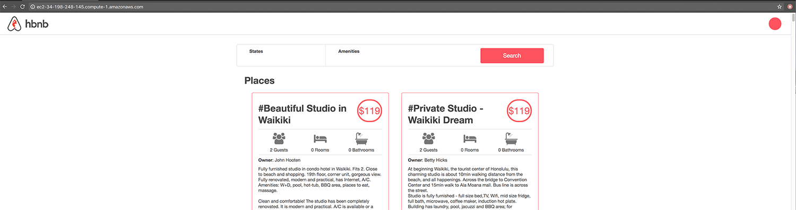

## Application server

### Context

[](https://youtu.be/pSrKT7m4Ego)

Your web infrastructure is already serving web pages via `Nginx` that you installed in your [first web stack project](../0x0C-web_server/). While a web server can also serve dynamic content, this task is usually given to an application server. In this project you will add this piece to your infrastructure, plug it to your `Nginx` and make is serve your Airbnb clone project.

### Resources

**Read or watch**:

- [Application server vs web server](https://www.nginx.com/resources/glossary/application-server-vs-web-server/)
- [How to Serve a Flask Application with Gunicorn and Nginx on Ubuntu 16.04](https://www.digitalocean.com/community/tutorials/how-to-serve-flask-applications-with-gunicorn-and-nginx-on-ubuntu-16-04) (As mentioned in the video, do **not** install Gunicorn using `virtualenv`, just install everything globally)
- [Running Gunicorn](https://docs.gunicorn.org/en/latest/run.html)
- [Be careful with the way Flask manages slash](https://werkzeug.palletsprojects.com/en/3.0.x/routing/) in [route](https://werkzeug.palletsprojects.com/en/3.0.x/tutorial/#step-4-the-routing) - `strict_slashes`
- [Upstart documentation](https://doc.ubuntu-fr.org/upstart)

### Tasks

<details>
<summary>0. Set up development with Python</summary>

Let's deploy the content you created for [AirBnB clone v2 - Web framework](https://github.com/meriembenayad/airBnB_clone_v2/tree/master/web_flask) on `web-01`. This task focuses on configuring your development environment for testing and debugging purposes before moving the code to the production environment.

_Requirements:_

- Ensure that [task #3](../0x0B-ssh/) from your [SSH project](../0x0B-ssh/) is completed for `web-01`. The checker will establish a connection to your servers.
- Install the `net-tools` package on your server: `sudo apt install -y net-tools`
- Clone your `AirBnB_clone_v2` using Git on your `web-01` server.
- Configure the file `web_flask/0-hello_route.py` to serve its content from the route `/airbnb-onepage/` on port `5000`.
- Ensure that your Flask application object is named `app` (this allows us to execute and validate your code).

_Example:_

**_Window 1:_**

```bash
ubuntu@229-web-01:~/AirBnB_clone_v2$ python3 -m web_flask.0-hello_route
 * Serving Flask app "0-hello_route" (lazy loading)
 * Environment: production
   WARNING: Do not use the development server in a production environment.
   Use a production WSGI server instead.
 * Debug mode: off
 * Running on http://0.0.0.0:5000/ (Press CTRL+C to quit)
35.231.193.217 - - [02/May/2019 22:19:42] "GET /airbnb-onepage/ HTTP/1.1" 200 -
```

**_Window 2:_**

```bash
ubuntu@229-web-01:~/AirBnB_clone_v2$ curl 127.0.0.1:5000/airbnb-onepage/
Hello HBNB!ubuntu@229-web-01:~/AirBnB_clone_v2$
```

***
**File:**
- File: `README.md`
</details>


<details>
<summary>1. Set up production with Gunicorn</summary>

Now that your development environment is configured, let's set up your production application server with `Gunicorn` on `web-01`, using port `5000`. Ensure the installation of `Gunicorn` and any necessary libraries for your application. Your `Flask` application object will serve as the [WSGI](https://www.fullstackpython.com/wsgi-servers.html) entry point into your application in the production environment. The aim is to use the same port for both production and development to maintain consistency in serving dynamic content.

_Requirements:_

- Install `Gunicorn` and any other required libraries for your application.
- Ensure that the Flask application object is named `app` (to facilitate code validation).
- Serve the same content from the same route as in the previous task. You can confirm its functionality by binding a `Gunicorn` instance to localhost on port `5000` with your application object as the entry point.
- For code validation, the checker will bind a `Gunicorn` instance to port `6000`, so make sure nothing is listening on that port.

_Example:_

**_Terminal 1:_**

```bash
ubuntu@229-web-01:~/AirBnB_clone_v2$ gunicorn --bind 0.0.0.0:5000 web_flask.0-hello_route:app
[2019-05-03 20:47:20 +0000] [3595] [INFO] Starting gunicorn 19.9.0
[2019-05-03 20:47:20 +0000] [3595] [INFO] Listening at: http://0.0.0.0:5000 (3595)
[2019-05-03 20:47:20 +0000] [3595] [INFO] Using worker: sync
[2019-05-03 20:47:20 +0000] [3598] [INFO] Booting worker with pid: 3598
```

**_Terminal 2:_**

```bash
ubuntu@229-web-01:~$ curl 127.0.0.1:5000/airbnb-onepage/
Hello HBNB!ubuntu@229-web-01:~$
```

***
**Directory:**
- Directory: `0x1A-application_server`
</details>


<details>
<summary>2. Serve a page with Nginx</summary>

Building upon your progress in the previous tasks, configure `Nginx` to serve your page from the route `/airbnb-onepage/`.

_Requirements:_

- `Nginx` should serve this page locally and on its public IP on port `80`.
- Proxy requests from `Nginx` to the process listening on port `5000`.
- Submit your `Nginx` configuration file as `2-app_server-nginx_config`.

**_Notes:_**

- To test this, you'll need to start either your production or development application server (listening on port `5000`).
- In a production environment, the application server would typically be configured to start upon system initialization, which will be covered in advanced tasks.
- You may need to reboot your server (using the command `$ sudo reboot`) for `Nginx` to be publicly accessible.

_Example:_

**_On my server:_**

**_Window 1:_**

```bash
ubuntu@229-web-01:~/AirBnB_clone_v2$ gunicorn --bind 0.0.0.0:5000 web_flask.0-hello_route:app
[2019-05-06 20:43:57 +0000] [14026] [INFO] Starting gunicorn 19.9.0
[2019-05-06 20:43:57 +0000] [14026] [INFO] Listening at: http://0.0.0.0:5000 (14026)
[2019-05-06 20:43:57 +0000] [14026] [INFO] Using worker: sync
[2019-05-06 20:43:57 +0000] [14029] [INFO] Booting worker with pid: 14029
```

**_Window 2:_**

```bash
ubuntu@229-web-01:~/AirBnB_clone_v2$ curl 127.0.0.1/airbnb-onepage/
Hello HBNB!ubuntu@229-web-01:~/AirBnB_clone_v2$
```

**_On my local terminal:_**

```bash
vagrant@ubuntu-xenial:~$ curl -sI 35.231.193.217/airbnb-onepage/
HTTP/1.1 200 OK
Server: nginx/1.10.3 (Ubuntu)
Date: Mon, 06 May 2019 20:44:55 GMT
Content-Type: text/html; charset=utf-8
Content-Length: 11
Connection: keep-alive
X-Served-By: 229-web-01

vagrant@ubuntu-xenial:~$ curl 35.231.193.217/airbnb-onepage/
Hello HBNB!vagrant@ubuntu-xenial:~$
```

***
**File:**
- File: `2-app_server-nginx_config`
</details>


<details>
<summary>3. Add a route with query parameters</summary>

Building upon your previous tasks, let's enhance our web application by introducing another service for `Gunicorn` to handle. In `AirBnB_clone_v2/web_flask/6-number_odd_or_even`, the route `/number_odd_or_even/<int:n>` is already defined to render a page indicating whether an integer is odd or even. Your task is to configure `Nginx` to proxy HTTP requests to the route `/airbnb-dynamic/number_odd_or_even/(any integer)` to a `Gunicorn` instance listening on port `5001`. The challenge here is to set up `Nginx` to proxy requests to processes on two different ports. You are not required to keep your application server processes running. If you need guidance on running multiple instances of `Gunicorn` without having multiple terminals open, refer to the tips below.

_Requirements:_

- `Nginx` should serve this page both locally and on its public IP on port `80`.
- Proxy requests from `Nginx` to the route `/airbnb-dynamic/number_odd_or_even/(any integer)` to the process listening on port `5001`.
- Submit your `Nginx` configuration file as `3-app_server-nginx_config`.

_Tips:_

- Check out these articles/docs for hints on configuring `Nginx`: [Understanding Nginx Server and Location Block Selection Algorithms](https://www.digitalocean.com/community/tutorials/understanding-nginx-server-and-location-block-selection-algorithms#matching-location-blocks), [Understanding Nginx Location Blocks Rewrite Rules](http://blog.pixelastic.com/2013/09/27/understanding-nginx-location-blocks-rewrite-rules/), [Nginx Reverse Proxy](https://docs.nginx.com/nginx/admin-guide/web-server/reverse-proxy/#).
- To launch a `Gunicorn` instance as a detached process, you can use the terminal multiplexer utility `tmux`. Execute the command `tmux new-session -d 'gunicorn --bind 0.0.0.0:5001 web_flask.6-number_odd_or_even:app'`. If successful, you should see no output on the screen. Confirm that the process has been created by running `pgrep gunicorn` to view its PID. When ready to end the process, either run `tmux a` to reattach to the processes or use `kill <PID>` to terminate the background process by ID.

_Example:_

**_Terminal 1:_**

```bash
ubuntu@229-web-01:~/AirBnB_clone_v2$ tmux new-session -d 'gunicorn --bind 0.0.0.0:5000 web_flask.0-hello_route:app'
ubuntu@229-web-01:~/AirBnB_clone_v2$ pgrep gunicorn
1661
1665
ubuntu@229-web-01:~/AirBnB_clone_v2$ tmux new-session -d 'gunicorn --bind 0.0.0.0:5001 web_flask.6-number_odd_or_even:app'
ubuntu@229-web-01:~/AirBnB_clone_v2$ pgrep gunicorn
1661
1665
1684
1688

ubuntu@229-web-01:~/AirBnB_clone_v2$ curl 127.0.0.1:5000/airbnb-onepage/
Hello HBNB!ubuntu@229-web-01:~/AirBnB_clone_v2$

ubuntu@229-web-01:~/AirBnB_clone_v2$ curl 127.0.0.1:5001/number_odd_or_even/6
<!DOCTYPE html>
<HTML lang="en">
  <HEAD>
    <TITLE>HBNB</TITLE>
  </HEAD>
  <BODY><H1>Number: 6 is even</H1></BODY>
</HTML>ubuntu@229-web-01:~/AirBnB_clone_v2
ubuntu@229-web-01:~$ 
ubuntu@229-web-01:~/AirBnB_clone_v2$ curl 127.0.0.1/airbnb-dynamic/number_odd_or_even/5
<!DOCTYPE html>
<HTML lang="en">
  <HEAD>
    <TITLE>HBNB</TITLE>
  </HEAD>
  <BODY><H1>Number: 5 is odd</H1></BODY>
</HTML>ubuntu@229-web-01:~/AirBnB_clone_v2$
```

**_Local machine:_**

```bash
vagrant@ubuntu-xenial:~$ curl 35.231.193.217/airbnb-dynamic/number_odd_or_even/6<!DOCTYPE html>
<HTML lang="en">
  <HEAD>
    <TITLE>HBNB</TITLE>
  </HEAD>
  <BODY><H1>Number: 6 is even</H1></BODY>
</HTML>vagrant@ubuntu-xenial:~$
```

***
**File:**
- File: `3-app_server-nginx_config`
</details>


<details>
<summary>4. Let's do this for your API</summary>

Let's deploy what you've built for [AirBnB clone v3 - RESTful API](https://github.com/meriembenayad/AirBnB_clone_v3) on `web-01`.

Requirements:

- Clone your `AirBnB_clone_v3` repository.
- Configure `Nginx` so that the route `/api/` directs to a `Gunicorn` instance listening on port `5002`.
- Ensure that `Nginx` serves this page both locally and on its public IP on port `80`.
- To test your setup, bind `Gunicorn` to `api/v1/app.py`.
- You may find it helpful to import your data (and environment variables) from [this project](https://github.com/meriembenayad/AirBnB_clone_v2).
- Submit your `Nginx` configuration file as `4-app_server-nginx_config`.

__Example:__

**_Terminal 1:_**

```bash
ubuntu@229-web-01:~/AirBnB_clone_v3$ tmux new-session -d 'gunicorn --bind 0.0.0.0:5002 api.v1.app:app'
ubuntu@229-web-01:~/AirBnB_clone_v3$ curl 127.0.0.1:5002/api/v1/states
[{"__class__":"State","created_at":"2019-05-10T00:39:27.032802","id":"7512f664-4951-4231-8de9-b18d940cc912","name":"California","updated_at":"2019-05-10T00:39:27.032965"},{"__class__":"State","created_at":"2019-05-10T00:39:36.021219","id":"b25625c8-8a7a-4c1f-8afc-257bf9f76bc8","name":"Arizona","updated_at":"2019-05-10T00:39:36.021281"}]
ubuntu@229-web-01:~/AirBnB_clone_v3$
ubuntu@229-web-01:~/AirBnB_clone_v3$ curl 127.0.0.1/api/v1/states
[{"__class__":"State","created_at":"2019-05-10T00:39:27.032802","id":"7512f664-4951-4231-8de9-b18d940cc912","name":"California","updated_at":"2019-05-10T00:39:27.032965"},{"__class__":"State","created_at":"2019-05-10T00:39:36.021219","id":"b25625c8-8a7a-4c1f-8afc-257bf9f76bc8","name":"Arizona","updated_at":"2019-05-10T00:39:36.021281"}]
ubuntu@229-web-01:~/AirBnB_clone_v3$
```

**_Local Terminal:_**

```bash
vagrant@ubuntu-xenial:~$ curl 35.231.193.217/api/v1/states
[{"__class__":"State","created_at":"2019-05-10T00:39:27.032802","id":"7512f664-4951-4231-8de9-b18d940cc912","name":"California","updated_at":"2019-05-10T00:39:27.032965"},{"__class__":"State","created_at":"2019-05-10T00:39:36.021219","id":"b25625c8-8a7a-4c1f-8afc-257bf9f76bc8","name":"Arizona","updated_at":"2019-05-10T00:39:36.021281"}]
vagrant@ubuntu-xenial:~$
```

***
**File:**
- File: `4-app_server-nginx_config`
</details>


<details>
<summary>5. Serve your AirBnB clone</summary>

Let's deploy what you've built for [AirBnB clone - Web dynamic](https://github.com/meriembenayad/AirBnB_clone_v4) on `web-01`.

Requirements:

- Clone your `AirBnB_clone_v4` repository.
- Configure your `Gunicorn` instance to serve content from `web_dynamic/2-hbnb.py` on port `5003`.
- Set up `Nginx` so that the route `/` points to your `Gunicorn` instance.
- Ensure that `Nginx` properly serves the static assets found in `web_dynamic/static/` (this is essential for your page to render properly).
- Reconfigure `web_dynamic/static/scripts/2-hbnb.js` to the correct IP for your website to be fully functional.
- `Nginx` must serve this page both locally and on its public IP on port `5003`.
- Verify that you have no errors by pulling up your Developer Tools on your favorite browser.
- Upload your `Nginx` configuration as `5-app_server-nginx_config`.

After loading, your website should look like this:



***
**File:**
- File: `5-app_server-nginx_config`
</details>


<details>
<summary>6. Deploy it!</summary>

Once you've configured your application server, it's essential to set it up to run by default when Linux is booted. This ensures that your `Gunicorn` process(es) automatically start as part of the system initialization process, eliminating the need for manual restarts during server downtime. To achieve this, we will utilize `systemd`, a system initialization daemon for the Linux OS.

**Requirements:**

- Write a `systemd` script that initiates a `Gunicorn` process to serve the same content as in the previous task (`web_dynamic/2-hbnb.py`).
- The `Gunicorn` process should spawn three worker processes.
- Errors should be logged in `/tmp/airbnb-error.log`.
- Access logs should be recorded in `/tmp/airbnb-access.log`.
- The process should be bound to port `5003`.
- Store your `systemd` script (`gunicorn.service`) in the appropriate directory on `web-01`.
- Ensure that you start the `systemd` service and leave it running.
- Upload `gunicorn.service` to GitHub.

Example:

```bash
bob@dylan:~$ curl -s 127.0.0.1:5003/2-hbnb | tail -5
    </div>
    <footer>
      <p>Holberton School</p>
    </footer>
  </body>
</html>
bob@dylan:~$ 
bob@dylan:~$ curl -s 12.13.14.15/ | tail -5
    </div>
    <footer>
      <p>Holberton School</p>
    </footer>
  </body>
</html>
bob@dylan:~$ 
```

***
**File:**
- File: `gunicorn.service`
</details>


<details>
<summary>7. No service interruption</summary>

One of the critical metrics for any internet-based business is uptime, representing the percentage of time a service/product remains accessible to customers over a given period. Consider Amazon.com, where every minute of downtime costs the company $2 million ([source](https://storageservers.wordpress.com/2016/03/14/amazon-downtime-costs-2-million-loss-per-minute/)). Application servers often require restarts for code or configuration updates, leading to downtime.

To mitigate downtime, application servers adopt a master/workers infrastructure. The master is responsible for:

- Receiving requests
- Managing workers (starting, stopping)
- Distributing requests to workers

Workers process queries by generating dynamic content through the application code. To update an application without downtime, the master orchestrates a progressive rollout:

1. Gracefully shut down some workers: instructs them to finish processing existing requests but not accept new ones.
2. Start new workers with the updated code/configuration.
3. Repeat the process until all old workers are replaced.

Here's a simple Bash script to reload Gunicorn gracefully:

```bash
#!/bin/bash

# Get the process ID of the Gunicorn master
MASTER_PID=$(pgrep -f 'gunicorn.*web_flask.0-hello_route:app')

# Gracefully restart Gunicorn
kill -s TERM $MASTER_PID

# Wait for the master to finish gracefully shutting down workers
sleep 2

# Verify that the master and workers have been renewed
ps auxf | grep gunicorn
```

_Example:_

```bash
sylvain@ubuntu$ ps auxf | grep gunicorn
# ... (existing processes)
sylvain@ubuntu$ ./4-reload_gunicorn_no_downtime
sylvain@ubuntu$ ps auxf | grep gunicorn
# ... (updated processes)
sylvain@ubuntu$
```

In this example, the script gracefully restarts Gunicorn, allowing the master to renew all workers without downtime. After testing, you can use the command `$ sudo reboot` to reboot your server (not `shutdown!!`).

***
**File:**
- File: `4-reload_gunicorn_no_downtime`
</details>
